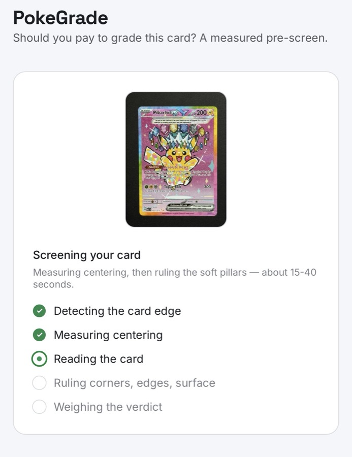
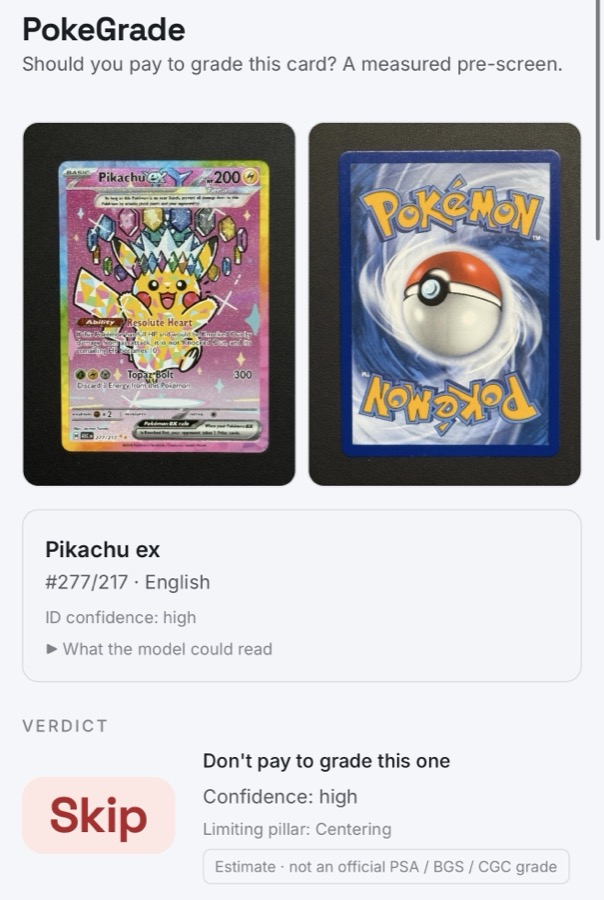
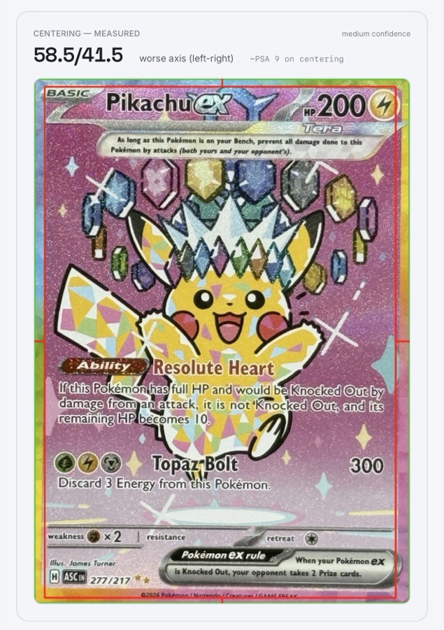
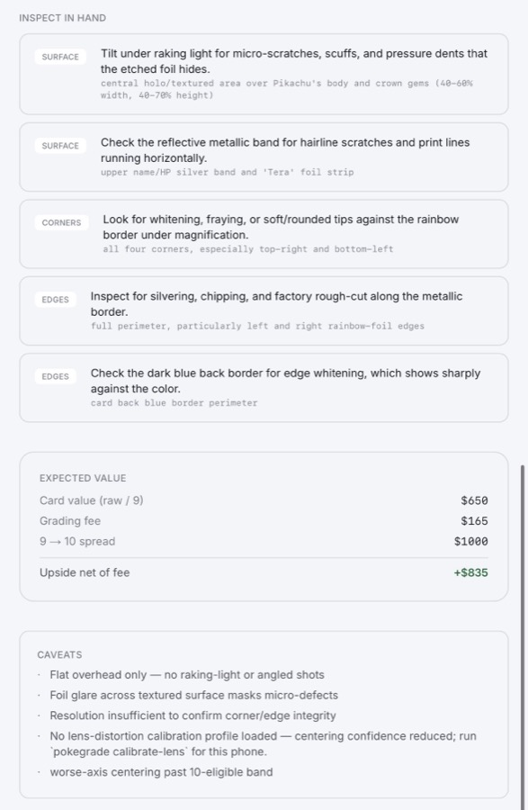

# PokeGrade

Submit photos of a modern Pokémon card and get a **verdict**: **SUBMIT**, **IN-HAND CHECK**, or **SKIP**. PokeGrade does not ask "what grade is this?" — it answers the money question: *should I pay the fee and wait weeks to grade this card?*

It is a pre-grading **second opinion**, not an official PSA / Beckett / CGC grade.

## What makes it different

Most pre-grading apps let a vision model eyeball centering from one quick photo. PokeGrade splits the job by what can actually be measured:

- **Centering is measured, not guessed.** A Python + OpenCV engine detects the card, warps it square, and measures the four border widths, then maps the worse axis onto the PSA ladder. A measured worse-axis past 55/45 is a deterministic 10-killer.
- **The soft pillars are ruled by Claude.** Corners, edges, and surface are adjudicated by Claude Opus 4.8 from the photos, defaulting to *could-not-assess* wherever a flat shot can't confirm flawlessness — which routes the card to an honest in-hand check rather than a flattering grade.
- **The verdict is EV-aware.** Give it the card value, the grading fee, and the 9→10 spread and it won't tell you to submit a card whose upside doesn't clear the fee.
- **Every prediction is logged.** A local SQLite ledger records the prediction and (later) the official grade, the substrate for an open, miss-inclusive verified log.

The terminal verdict is computed deterministically; Claude fills the judgment the CV can't.

## Showcase

A real screening run on a phone (`npm run dev:lan`), one Pikachu ex, front and back photos only — no close-ups, no lens calibration loaded.

| Screening in progress | Verdict: Skip |
| --- | --- |
| [](docs/screenshots/analyzing.jpg) | [](docs/screenshots/result-skip.jpg) |

| Measured centering | Loupe checklist + expected value |
| --- | --- |
| [](docs/screenshots/centering-detail.jpg) | [](docs/screenshots/loupe-ev.jpg) |

Centering measured 58.5/41.5 on the worse axis — past the PSA-10 cutoff — which alone caps this card below a 10 and drives the Skip verdict. No close-ups were shot for this run either, so corners, edges, and surface all come back could-not-assess rather than clean, which is why the loupe checklist below asks for five separate in-hand checks. That's the exact gap the [capture guidance](#how-to-get-a-trustworthy-read) further down exists to close. Also note the caveat that no lens-calibration profile was loaded for this phone, which is why centering confidence reads medium instead of high (`pokegrade calibrate-lens` fixes that per-phone).

## Architecture

```
  Phone / web UI (Next.js)   capture + verdict + history
        |  POST images (multipart)
        v
  FastAPI engine (uvicorn, 127.0.0.1:8000)   owns the SQLite ledger
        |-- centering.py   deterministic OpenCV measurement, fail-closed
        |-- verdict.py     EV-aware SUBMIT / IN_HAND_CHECK / SKIP
        |-- ledger.py      append-only prediction + actual
        v
  Claude Opus 4.8 (adjudicator)   rules corners/edges/surface, writes the loupe checklist
```

`npm run dev` starts both the Python engine and Next together. **v1 is local-only** — the engine + SQLite ledger run on your Mac (they can't run on Vercel's serverless).

## Quick start

```bash
# 1. JS deps
npm install

# 2. Python engine deps (uv manages its own venv)
uv sync --project engine

# 3. Anthropic API key (used by the engine's adjudicator)
cp .env.local.example .env.local
#    then paste your key from https://console.anthropic.com/settings/keys

# 4. Run the web app + engine together
npm run dev          # http://localhost:3000  (this Mac only)
# or
npm run dev:lan      # also reachable from your phone over wifi
```

The engine logs as `engine` (blue) and Next as `web` (green). If a request returns "the grading engine is not reachable", the Python engine hasn't booted yet — give it a moment and retry, or run it alone with `uv run --project engine pokegrade serve`.

## Using it from your phone (same wifi)

```bash
npm run dev:lan
```

Next prints a **Network:** URL like `http://192.168.1.103:3000`. Open it on your phone (same wifi as the Mac). The "Camera" button opens the camera directly — no HTTPS or deploy needed (it uses the native camera picker, not the browser webcam API, so plain HTTP over LAN works). The route proxies to the engine on `127.0.0.1:8000` server-side, so only Next needs to be on the LAN.

## How to get a trustworthy read

- **Shoot the front flat and square-on, filling the frame**, on a plain mid-grey background so the card edge segments cleanly. Centering is measured from this shot — an angled or cluttered shot degrades it.
- HDR and sharpening **off** — phone processing invents or hides defects.
- Add **close-ups** of corners and any suspect area so Claude can rule the soft pillars instead of routing them to an in-hand check.
- A one-time per-phone **lens calibration** (`uv run --project engine pokegrade calibrate-lens <chessboard-photos>`) removes barrel distortion that corrupts border ratios. The web path runs with or without it and flags reduced confidence when none is loaded.

See [engine/PROTOCOL.md](engine/PROTOCOL.md) for the full capture spec.

## The CLI

The engine ships a `pokegrade` CLI (the local ingest path, which retains fuller EXIF validation than the web path):

```bash
uv run --project engine pokegrade ingest <card-folder> --value 120 --fee 25 --spread 95
uv run --project engine pokegrade record-actual <card_id> --grade 9 --cert 12345678
uv run --project engine pokegrade report          # false-submits + skips that gemmed
uv run --project engine pokegrade calibrate-lens <chessboard-folder>
```

`ingest` writes the centering overlay PNG and the full response to `engine/.data/runs/<card_id>/`.

## Honest limitations (v1)

- **Local-only.** The engine + SQLite ledger don't run on Vercel; publishing the verified log later is real hosting scope, not a config flip.
- **Surface is a flagged blind spot.** Flat photos miss the micro-scratches and micro-whitening that cap pack-fresh foils, so a clean-looking card's honest verdict is IN-HAND CHECK with a coordinate checklist, not a confident SUBMIT. Raking-light surface CV is phase 2.
- **Browser uploads degrade provenance.** Phones strip/alter EXIF, so capture validation is weaker on the web path than the local CLI ingest.
- **Centering's ±2pp target is conditional** — it assumes the centering shot follows the guidance and a lens-calibration profile is loaded.

## Configuration

| Env var             | Default                 | Notes                                                           |
| ------------------- | ----------------------- | --------------------------------------------------------------- |
| `ANTHROPIC_API_KEY` | (required for soft pillars) | Used by the engine's adjudicator. Without it, centering + verdict still run; soft pillars route to in-hand check. |
| `MODEL`             | `claude-opus-4-8`       | Adjudicator model. `claude-sonnet-4-6` for faster, cheaper runs. |
| `ENGINE_URL`        | `http://127.0.0.1:8000` | Where the Next route reaches the engine.                        |

## Tests

```bash
npm run engine:test       # pytest: centering maths, verdict boundaries, append-only ledger, e2e
```

The two highest-value targets — the centering measurement and the verdict decision function — have objective right answers and are covered behaviour + edge + error.

## Stack

Next.js 16 (App Router) · React 19 · TypeScript · Tailwind v4 — front-end.
Python (uv) · FastAPI · OpenCV · Pydantic · SQLite · `anthropic` — engine.

## Research

Background research informing accuracy and roadmap lives in [docs/research/](docs/research/):

- [Competitive landscape](docs/research/competitive-landscape.md) — the existing AI pre-grading apps and the open verified-returns-log gap PokeGrade can own.
- [Training data sources](docs/research/training-data-sources.md) — where to source image to official-grade data to validate and improve the verdict, and the label-leakage trap to avoid.
